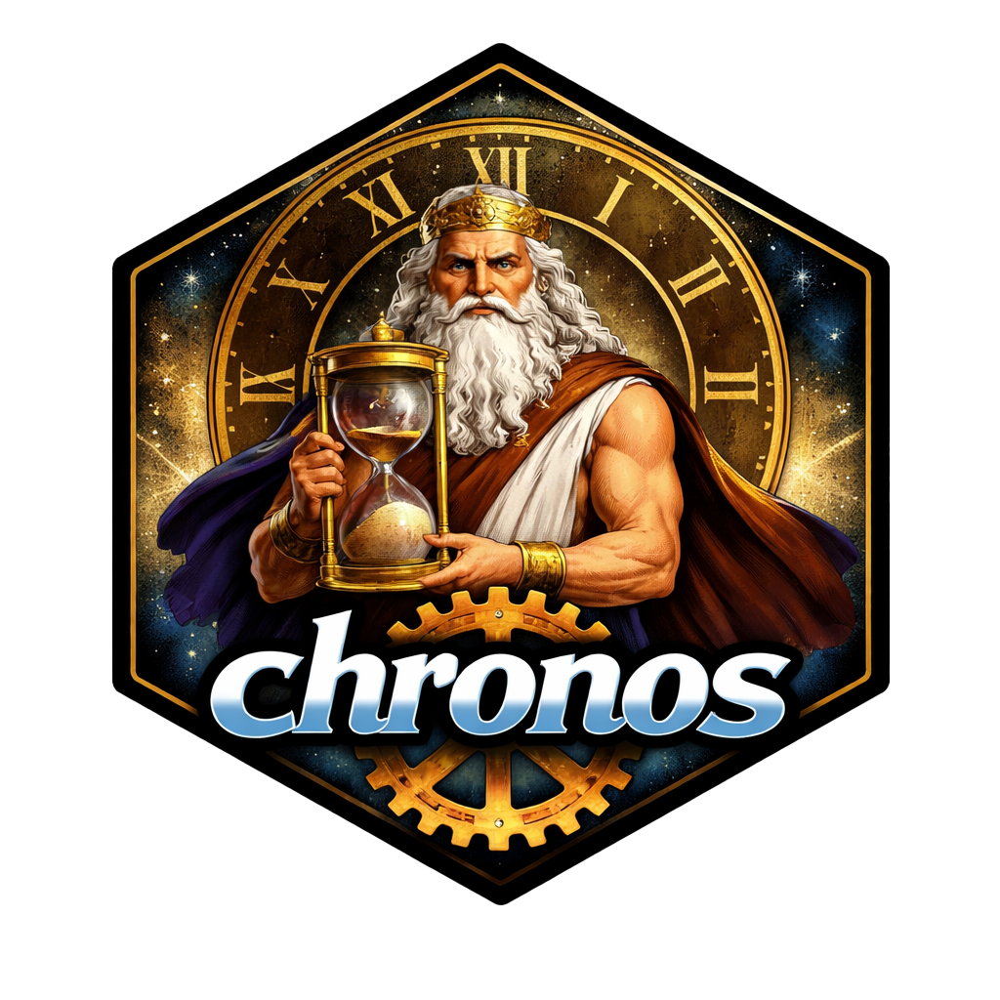

<!-- README.md is generated from README.Rmd. Please edit that file -->



# chronos

<!-- badges: start -->

[](https://github.com/viv-analytics/chronos/actions/workflows/R-CMD-check.yaml) [](https://app.codecov.io/gh/viv-analytics/chronos)

<!-- badges: end -->

The goal of chronos is to …

## Installation

You can install the development version of chronos from [GitHub](https://github.com/) with:

``` r
# install.packages("pak")
pak::pak("viv-analytics/chronos")
```